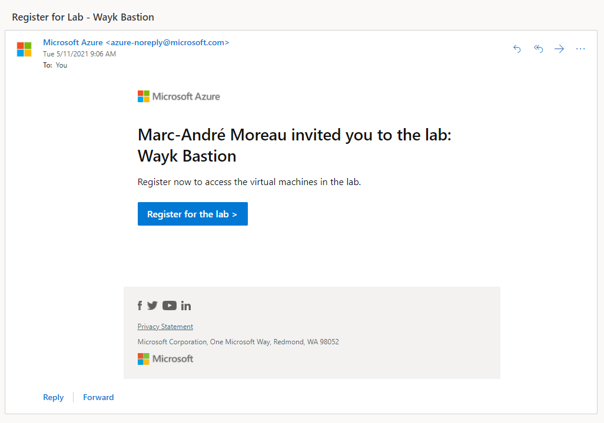
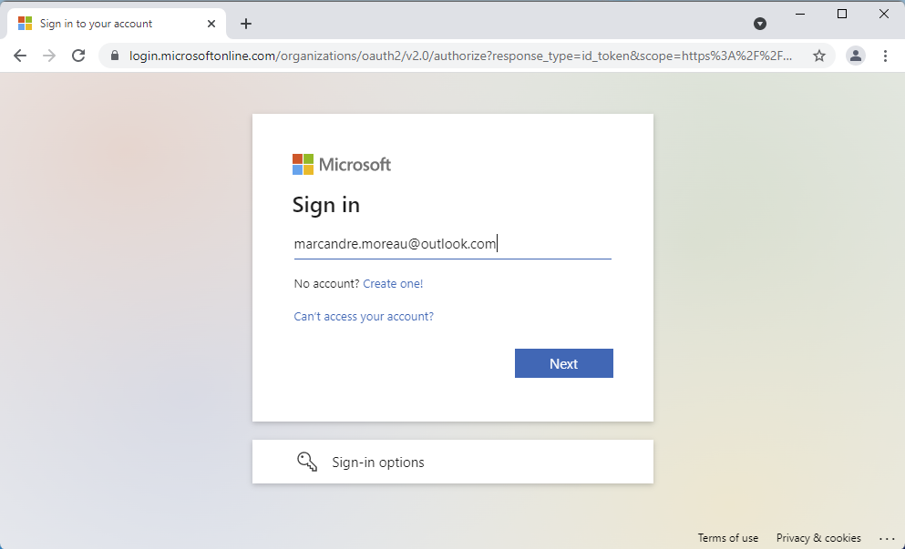
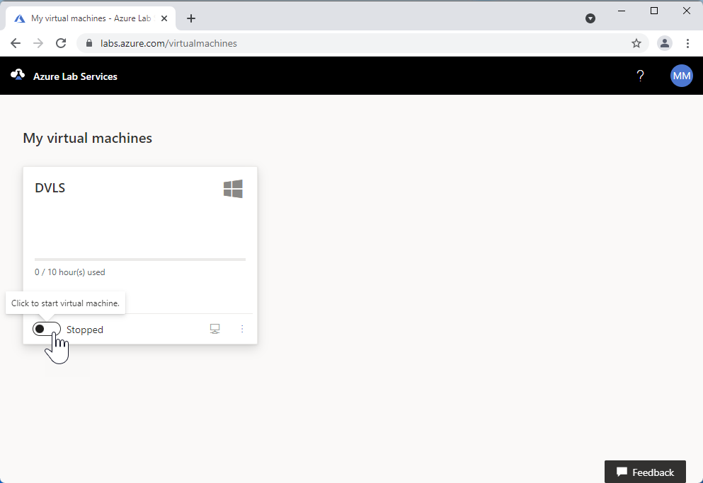
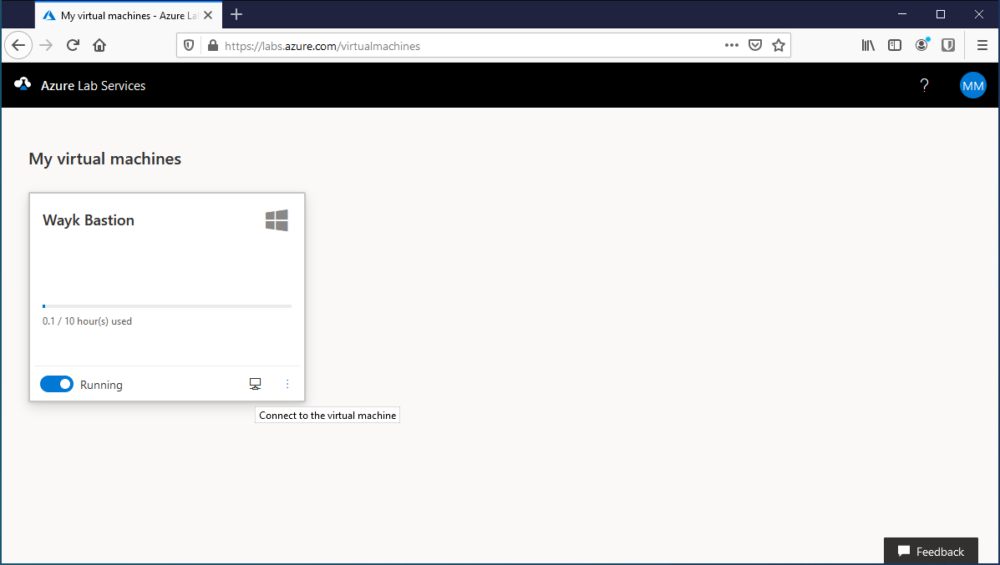
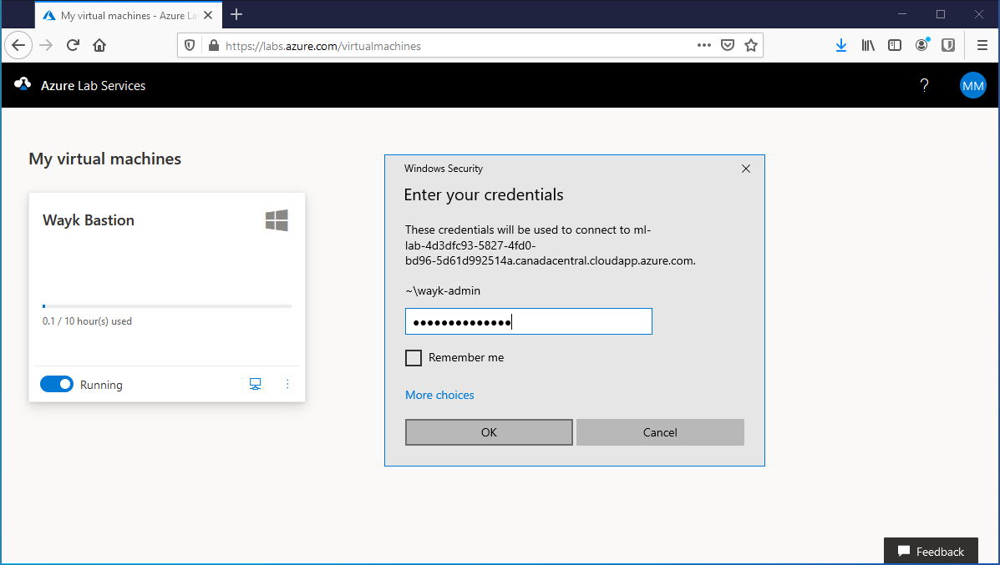
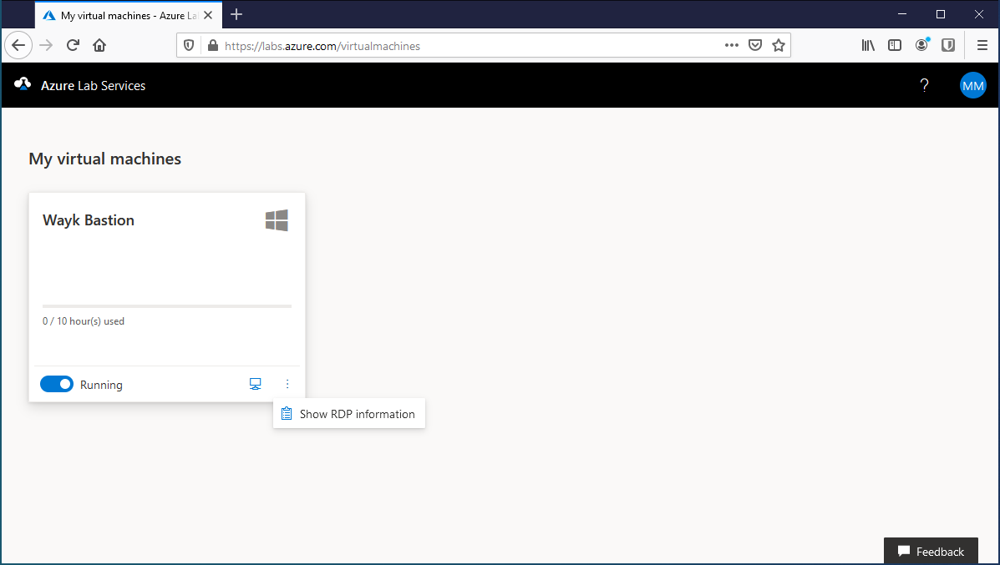
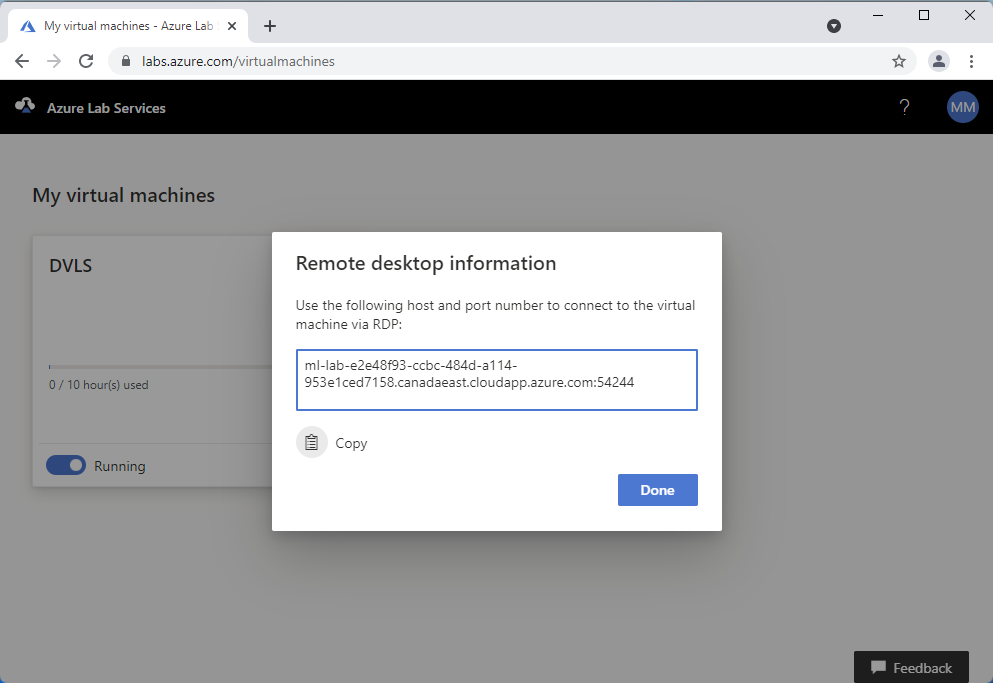
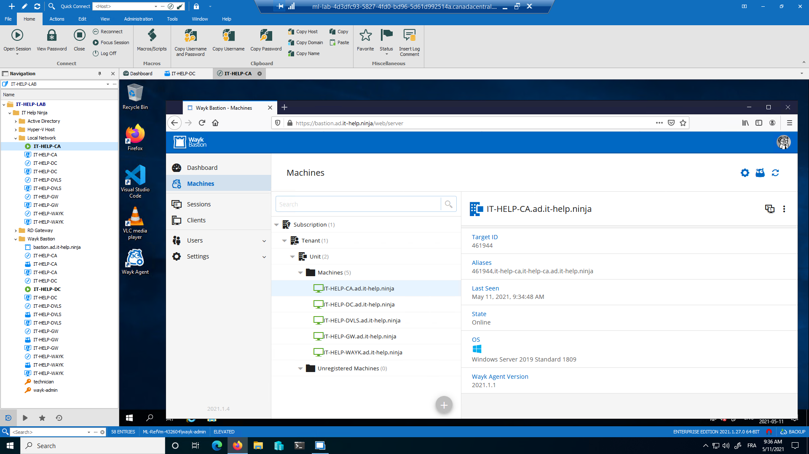
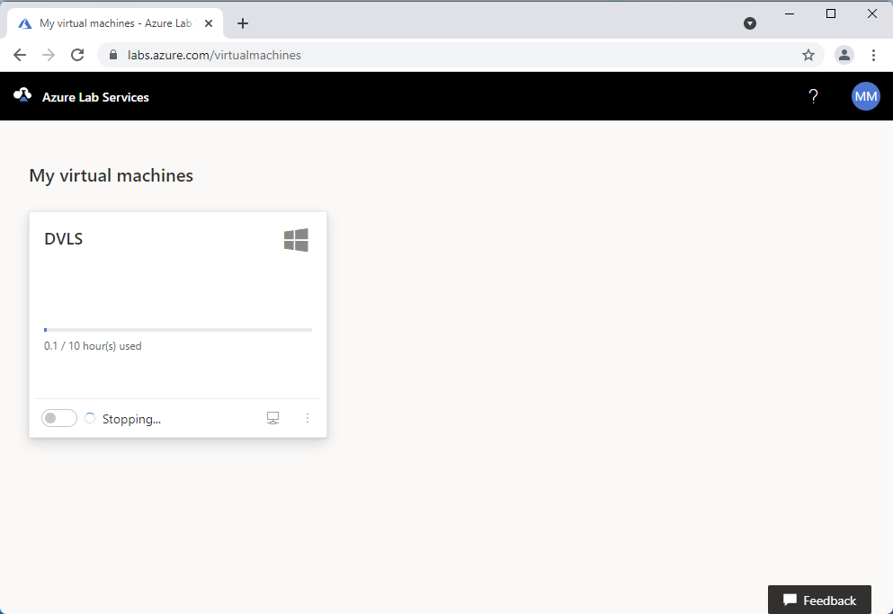

# Azure Lab Access

Welcome to Devolutions Labs! Chances are that you are on this page because you have received an email invitation to an [Azure Lab Services](https://azure.microsoft.com/en-us/services/lab-services/) virtual machine preconfigured with [Remote Desktop Manager](https://remotedesktopmanager.com/) and [Wayk Bastion](https://wayk.devolutions.net/). Each lab environment contains a complete, usable Windows domain with multiple machines that you can connect to for testing at your own pace.

## Accepting the invitation

Each invitation gives access to an independent copy of the lab environment for up to 10 hours. Save the credentials contained in the email for later. You can connect multiple times until the quota is used, if you need more feel free to contact us. Click on the **Register for the lab** link in the invitation email to claim your assigned virtual machine.

To accept the invitation, you need a Microsoft account. This can be a personal or a professional account, both should work. Once you accept an invitation with a Microsoft account, a virtual machine will be assigned to you:

The virtual machine is initially stopped, so click on the toggle button to start it, then wait a few minutes:

## Connecting to the lab VM

Once the virtual machine is booted, it will be marked as running. Click on the remote desktop button to download a .rdp file that can be opened by any [Microsoft Remote Desktop client](https://docs.microsoft.com/en-us/windows-server/remote/remote-desktop-services/clients/remote-desktop-clients).

On Windows, the built-in RDP client (mstsc.exe) should normally be launched by opening the downloaded .rdp file. Use the credentials that were provided in the invitation email to connect:

Alternatively, it is also possible to copy the RDP host information to manually launch the connection. Click on the ellipsis (⋮), then click on **Show RDP information**:

In the **Remote desktop information** dialog, click **Copy** to copy the RDP host information to the clipboard.

You can then paste the RDP host information manually into an RDP client to initiate the connection using the credentials provided in the email invitation.

## Lab environment overview

If everything worked, you should now have access to a Windows 10 virtual machine with Hyper-V and multiple nested virtual machines. Launch Remote Desktop Manager to find the all the connection entries and the credentials you may need. The Wayk Bastion web interface is hosted at [https://bastion.ad.it-help.ninja]

The lab is composed of multiple virtual machines:

* IT-HELP-RTR: Network router
* IT-HELP-DC: Domain controller
* IT-HELP-CA: Certificate authority
* IT-HELP-WAYK: Wayk Bastion host
* IT-HELP-DVLS: Devolutions Server (coming soon)
* IT-HELP-GW: RD Gateway, Devolutions Gateway

The RDM connection entries are structured in folders:

* Active Directory: test domain accounts
* Hyper-V Host: RDP and PowerShell Hyper-V connections
* Local Network: RDP and PowerShell network connections
* RD Gateway: RDP connections through RD Gateway
* Wayk Bastion: Wayk Remote Desktop, Wayk RDP and Wayk PowerShell connections through Wayk Bastion

## Disconnecting from the lab VM

Simply disconnecting from the VM will leave it running for 15 minutes before it becomes deallocated. To avoid wasting allocated minutes, it is better to manually stop the VM in Azure Lab Services:

It can take a few minutes for the virtual machine to be marked as stopped. However, you do not need to wait with the browser open for the process to complete:

Once stopped, the virtual machine can be started again at a later time to connect again, until all the hours in the assigned quota have been used.